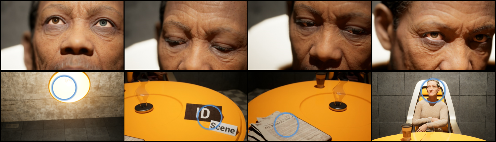
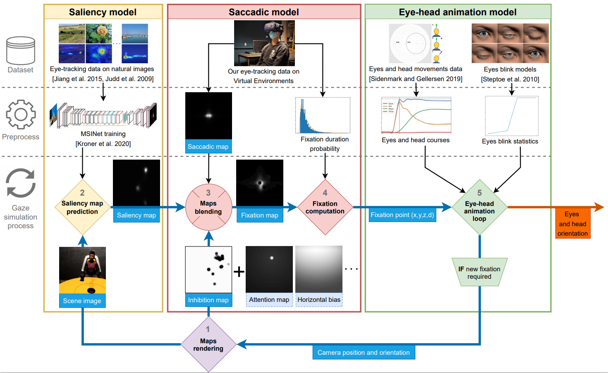

# Multi-map Saliency-driven Gaze Behavior for Virtual Characters

Unreal Engine project of [Multi-map Saliency-driven Gaze Behavior for Virtual Characters](https://hal.science/hal-03796523v2)  
In this work, we propose a general method to synthesize gaze behaviors for interactive characters by combining models of *visual saliency*, *saccadic movements*, and *eye-head animation*, while enabling designers to finely control customizable features.

> "Multi-map Saliency-driven Gaze Behavior for Virtual Characters; I. Goudé, A. Bruckert, A.H. Olivier, J.Pettré, R. Cozot, K. Bouatouch, M. Christie, L. Hoyet; in submission process; https://doi.org/10.1109/TVCG.2023.3244679"

## UPDATE - Project supported on UE 5.5.1
We recently updated our project to UE 5.5.1 to ease the reproductibility of our results.
The saliency map inference is now performed by the native Neural Network Engine (NNE) plugin.
We released a demo to demonstrate our real-time model as well.

## Requirements
Unreal Engine $\ge$ 5.5.1  
Visual Studio $\ge$ 2022 + [plugins](https://docs.unrealengine.com/4.26/en-US/ProductionPipelines/DevelopmentSetup/VisualStudioSetup/)  

## Install
<ol>
    <li> Install requirements </li>
    <li> Download the Unreal project: https://drive.google.com/file/d/1bj_HXSZBHFqv5-c9mSFLYpd63nBMO1RB/view?usp=sharing </li>
    <li> Right click on Saliency_driven_gaze.uproject -> Generate Visual Studio project files </li>
    <li> Open and build the project solution </li>
    <li> Open Unreal project and run Lobby_demo level </li>
</ol>

## Results

<html>
    <body>
        

            
        

    </body>
</html>
The figure shows a sequence of gaze and head motions automatically generated by our method (top row) through the identification and selection of salient features in the character's field of view (blue circle in the bottom row).

## Model

<html>
    <body>
        

            
        

    </body>

The flowchart of our method describing the five-step process:
<ol>
    <li> Rendering the image in the character's field of view </li>
    <li> The image of the scene is passed through a visual saliency model, which outputs an eye-fixation probability for each pixel </li>
    <li> The predicted saliency map is combined with several human oculomotor biases, and merged into a fixation distribution </li>
    <li> The position and the duration of the fixation are stochastically determined </li>
    <li> Given the character's current eye and head orientations, its gaze is animated towards the new fixation point. When the duration of the fixation is reached, the process is reiterated from step 1 </li>
</ol>
</html>

## Contact

> Ific Goudé  
Research Scientist in Computer Graphics  
Email: goude.ific@gmail.com  
Website: [https://igoude.github.io/](https://igoude.github.io/)
